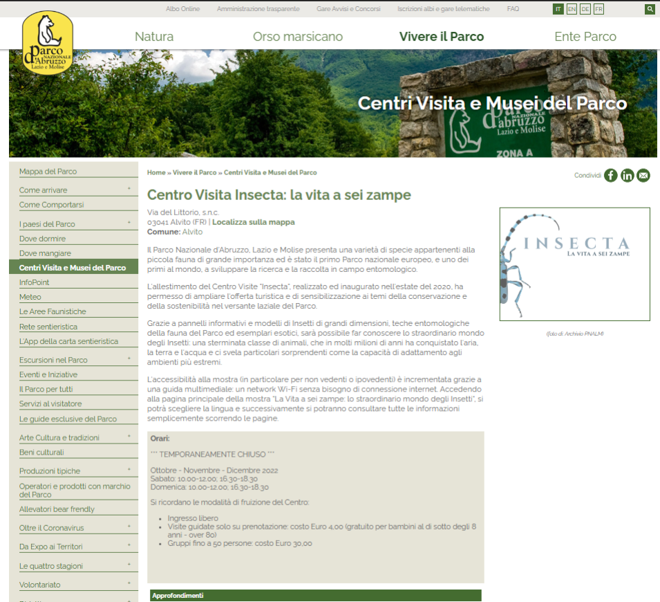

# 1. Progettazione concettuale

## 1.1 Requisiti iniziali
Si vuol realizzare un sistema che raccoglie e organizza tutte le informazioni relative alle aree 
protette italiane, offrendo una panoramica completa e dettagliata, e fornendo strumenti utili 
per la pianificazione di visite, la gestione delle aree stesse e dei servizi forniti. 

Per ogni parco, il sistema memorizza dettagli come il codice identificativo, il nome, la regione 
in cui si trova, la tipologia (ad esempio, parco nazionale o riserva naturale), l'ente che la 
gestisce, il provvedimento che ne ha sancito l'istituzione, le superfici terrestre e marina, i 
chilometri di costa e altre informazioni utili.  
Le aree protette sono classificate in base al tipo, seguendo la classificazione ufficiale 
(https://www.mase.gov.it/pagina/classificazione-delle-aree-naturali-protette).  
Inoltre, sul sito sono rappresentate come suddivise per regione. Alcuni parchi partecipano a 
programmi di certificazione come la Carta Europea del Turismo Sostenibile (CETS), che 
promuove pratiche turistiche rispettose dell'ambiente e del patrimonio naturale. 

Ogni sezione del sito dedicata ad una specifica area protetta ha una pagina dedicata alle 
ultime notizie, complete di data, foto e testo, per tenere aggiornati gli utenti su eventi e 
novità.  

Per chi desidera visitare l'area, il sistema deve fornire informazioni sui centri visita sufficienti 
per facilitare l’organizzazione di visite e percorsi. Questo è un esempio.

Per chi cerca un posto dove alloggiare, il sistema elenca le strutture ricettive nelle vicinanze, 
fornendo dettagli su nome, indirizzo, contatti, servizi offerti, trattamenti disponibili ed 
eventuali impegni ecologici. Alcune di queste strutture sono attrezzate per ospitare scuole o 
gruppi e dispongono di parcheggi adeguati. Inoltre, alcune aderiscono alla Carta Europea 
del Turismo Sostenibile, garantendo un'esperienza rispettosa dell'ambiente. 

Per gli appassionati di escursioni, il sistema descrive vari tragitti con informazioni su 
segnaletica, punto di partenza, modalità di percorrenza (a piedi, in bici, a cavallo), livello di 
difficoltà, tempo stimato di percorrenza e una lista di guide autorizzate con relative 
valutazioni. 

I visitatori possono registrarsi sul sito creando un profilo con username e password, che 
permette loro di inviare richieste di prenotazione alle strutture ricettive, specificando le date 
di soggiorno e il numero di ospiti. Le strutture ricevono queste richieste e, dopo aver 
verificato la disponibilità, possono accettarle o meno. 

Il sistema tiene traccia dei dati relativi alle presenze di ogni area protetta, registrando orari di 
entrata e uscita, tipologia di utente (senior, bambini, gruppi scolastici, altri gruppi), itinerari 
percorsi e feedback sotto forma di valutazioni a stelle per ogni percorso. Il sistema consente 
ad ogni visitatore di esprimere un giudizio (in stelle), che aggiorna la valutazione degli 
itinerari, e di lasciare un commento. Inoltre, conserva i commenti postati sul sito del parco e 
le valutazioni date alle guide.

Il sistema permette di prenotare visite guidate in orari specifici con delle guide abilitate i cui 
estremi (licenze, itinerari disponibili per ciascuna guida, valutazioni da parte degli utenti 
passati, e calendario con le loro disponibilità) sono resi disponibili agli operatori turistici ed ai 
visitatori. Ogni itinerario può essere associato a una o più guide abilitate, e il sistema 
mantiene un registro aggiornato delle guide disponibili in ogni momento. Nella pagina degli 
itinerari, viene mostrato il numero di guide abilitate e il numero di quelle disponibili. 

Per quanto riguarda le visite guidate, il sistema organizza un numero definito di tour 
programmati per ogni itinerario, ciascuno con un numero massimo di partecipanti, uno stato 
attuale e una guida assegnata tra quelle abilitate. I gestori del parco possono consultare uno 
storico delle visite effettuate in ogni anno, utile per analisi di mercato e miglioramento dei 
servizi offerti. 

## 1.2 Requisiti rivisti

### 1.2.1 Frasi di carattere generale
Si vuole realizzare una base di dati per un'applicazione che raccoglie e organizza tutte le informazioni relative alle aree protette italiane.
La base di dati deve permettere:
- La consultazione di:
    - Aree protette.
    - Informazioni sui centri visita sufficienti per facilitare l'organizzazione di visite e percorsi.
    - Elenchi di strutture ricettive nelle vicinanze.
    - Informazioni relative alle escursioni come tragitti, punti di partenza ecc.
- La possibilita' di:
    - Recensire le Aree protette.
    - Prenotare visite guidate con orari e guide specifiche. 